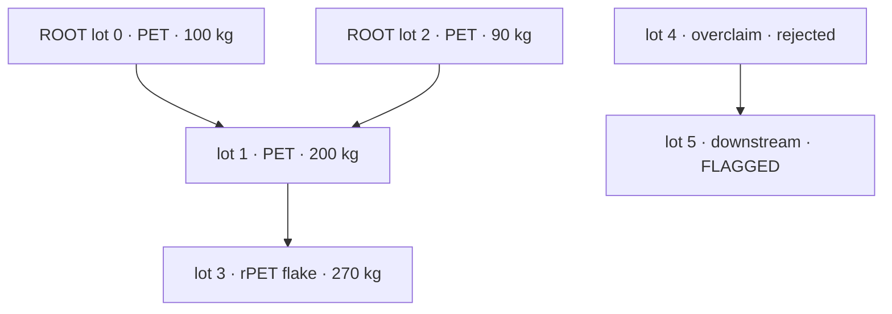

# Recur — RecycledVerify protocol

A registry where a recycled-content claim is only worth what its parents can actually supply. Recur models each material lot as a node in a directed acyclic graph on GenLayer, rejects any lot whose claimed recycled mass exceeds its verified upstream capacity, and only then lets a two-tier LLM audit score the claim against certifier/lab records fetched by the validators themselves.

Live registry: **[https://poopitto.github.io/recycled-verify/](https://poopitto.github.io/recycled-verify/)** — also mirrored at https://recycled-verify.vercel.app.

## The core assumption

A claim like "this batch is 85% post-consumer recycled" is a statement about where material came from. Recur treats that provenance as a graph: every batch, or *lot*, is a node, and an edge runs from each upstream batch into the batch it fed. A lot that claims recycled mass must inherit that mass from somewhere; if the parents cannot account for it, the claim fails on arithmetic before any model is ever consulted.

## How a lot moves through the registry

Eight states, walked in order:

1. **REGISTERED** — the claimant files a lot (label, material, region, lot mass, claimed recycled mass, parent lot ids) and posts a refundable GEN bond.
2. **TRACED** — the claimant submits a chain-of-custody trace plus two or three independent public HTTPS certifier/lab URLs. The URLs are normalized, deduplicated, and their SHA-256 prefix is stored as the evidence digest.
3. **BALANCE_OK** — the deterministic mass-balance gate passes (or the lot is REJECTED on the spot).
4. **AUDITED_T1** — the first LLM pass completes under validator consensus.
5. **AUDITED_T2** — the deep pass completes (mandatory for lots at or above 5 tonnes).
6. **LABELED** — settlement: the eco-label is issued (or denied) and the bond is refunded or slashed.
7. **REJECTED** — mass balance failed or the ruling is GREENWASH.
8. **FLAGGED** — an ancestor was overturned, so this lot is suspected and awaits re-audit.

## The mass-balance rule

`verify_mass_balance` is pure on-chain arithmetic; no LLM runs before it. For each parent it takes the recycled mass that parent has already verified (or, for a parent still mid-flight, its claimed value) and sums them into a *parent capacity*. A lot with no parents is a raw collection lot, and its capacity is simply its own lot mass. The lot passes when:

```
claimed_recycled_mass_kg <= parent_capacity_kg + 5  (tolerance in kg)
```

A failure writes `MASS_BALANCE_FAIL`, moves the lot to REJECTED, and the bond stays in the pool. A child can reference up to eight parents; a rejected or flagged parent blocks the whole check.

## Two-tier adjudication

`adjudicate` (T1) and `adjudicate_deep` (T2) run inside the GenVM. The leader and each validator independently:

1. Fetch every evidence URL with `gl.nondet.web.get`. The URL host list is validated at trace time (HTTPS only, public hosts only, no localhost or private ranges, no duplicate hosts).
2. Read the fetched records plus the claimant trace and each parent's verified history.
3. Return a strict JSON reading: `evidence_verified`, `sources_confirmed`, `recycled_pct`, `verification_summary`, `rationale`.

Validators agree on `evidence_verified`, on whether at least two sources were confirmed, on the percentage within ±12 points (T1) or ±18 points (T2), and on the ruling band. Evidence is treated as untrusted data — the prompt and the greybox filter reject prompt-injection tokens such as `ignore previous` or `<|im_start|>`.

The percentage maps to a ruling: **VERIFIED** ≥ 80, **PARTIAL** ≥ 30, **GREENWASH** below 30. T2 is mandatory at ≥ 5,000 kg and may be run on smaller lots; `issue_label` refuses to settle a high-value lot that has only passed T1.

## Bond economics

The base bond is 0.005 GEN. The required amount scales with how crowded the `(material, region)` cell already is:

```
required_bond = base * (10 + 15 * density) / 10
```

Each lot already registered in the same cell raises the required bond by 1.5× the base, which is the Sybil-pressure valve: spamming claims into a hot cell is deliberately expensive. A VERIFIED lot earns the label and gets its bond back; a PARTIAL lot clears without a label but still recovers its bond; a GREENWASH lot loses the bond to the pool. Settlement is transfer-first: `issue_label` performs the GEN transfer before touching accounting, so a failed transfer leaves the lot unsettled and retryable.

## Cascade flags

Trust flows down the graph, so suspicion does too. `cascade_flag_descendants` takes a rejected or flagged ancestor, walks the child edges breadth-first (bounded to 256 visits), and marks every still-live descendant as `DEPENDENCY_FLAGGED`, recording which ancestor caused it. Labels on those descendants are revoked until they are re-traced and re-adjudicated.

## The DAG in miniature



Node heights in the dashboard's DAG canvas are proportional to lot mass; a rejected node is hatched, a flagged node carries a lightning marker, and clicking any node opens its dossier.

## Contract surface

`RecycledVerify` exposes nine writes (seven public, two admin-only) and nine views.

**Claim pipeline**

| Method | Kind | Effect |
| --- | --- | --- |
| `register_lot` | payable | Creates a lot node; bond scales with cell density |
| `submit_trace` | write | Attaches the trace + 2–3 independent evidence URLs |
| `verify_mass_balance` | write | Deterministic DAG capacity check |
| `adjudicate` | write | T1 LLM audit on fetched evidence + parent history |
| `adjudicate_deep` | write | T2 deep audit; mandatory ≥ 5 t |
| `issue_label` | write | Issues/denies the eco-label, refunds or slashes the bond |
| `cascade_flag_descendants` | write | Flags every descendant of an overturned ancestor |

**Admin**

| Method | Effect |
| --- | --- |
| `advance_epoch` | Stamps the registry audit-trail clock (admin only) |
| `set_admin` | Rotates the admin/keeper address (admin only) |

**Views** — `get_lot` (full dossier), `get_lots_by_material`, `get_lots_by_region`, `get_material_region_density`, `get_ancestors`, `get_descendants`, `list_lots`, `get_pool_balance`, `get_counts` (seven counters: lots, audited, verified, rejected, cascade-flagged, labels, epoch).

## Frontend

`frontend/` is a React + Vite + TypeScript dashboard. A landing screen introduces the protocol with the verification spec and an FAQ; entering the manifest shows a stats strip, the bond pool, the SVG DAG canvas, a lot search, and a per-lot dossier with the lifecycle action buttons (submit trace, verify mass balance, adjudicate T1, adjudicate deep T2, issue label, cascade-flag). Registration posts the bond; the admin panel advances the epoch and rotates the admin key. The wallet connects through RainbowKit's injected-wallet connector, and the wagmi `walletClient` is passed into `contractService.ts` so every write is signer-authorized. Reads use a wallet-less `genlayer-js` client. The Vite config is pre-set with `base: "./"` for subpath hosting, and the build is chunk-split so the entry bundle stays under Vite's warning threshold.

## On-chain facts

| Item | Value |
| --- | --- |
| Chain | GenLayer Studionet, id `61999`, native `GEN` |
| Contract | `0x08487E30664a6fDFcF532C195499dC0CD33346FA` |
| Deployment tx | `0x0482e2f6d82efff5c81be342e82445a6dc911df470d00dbca85dfacde0ce1c5b` |
| `register_lot` smoke | `0xc3c11510a676dadf3dd07a957dc8aacc60b042cde9fbdbd8cd5573149d9d5704` |
| `submit_trace` smoke | `0x25f191d7dd7cc92b7c584b2c4aecc1844a266d61d35b2efa22270ff2f545fc14` |
| `verify_mass_balance` smoke | `0x7697e96f5f199091c94c567d5bce85a962115e27101d6543119236774dcfc428` |

## Run locally

```bash
cd frontend
npm install
npm run dev       # local dev server
npm run build     # tsc -b && vite build
npm run preview   # serve the production build
```

The committed config ships the public Studionet values, so no `.env` is required; copy `.env.example` to `.env.local` only to override.

## Environment variables

| Name | Description |
| --- | --- |
| `VITE_CONTRACT_ADDRESS` | Deployed `RecycledVerify` address (Studionet) |
| `VITE_CHAIN_ID` | GenLayer chain id (`61999`) |
| `VITE_RPC_URL` | Studionet JSON-RPC endpoint |

## Verification

```bash
PYTHONUTF8=1 genvm-lint check backend/recycled-verify.py --json
python -m pytest tests/direct -q
cd frontend && npm install && npm run build
```

The direct tests pin four review paths: evidence sources must be independent public HTTPS hosts, T1 grounds itself in fetched evidence and the bond refund is retryable across a simulated transfer failure, high-value lots are blocked from settlement until T2, and a mass-balance failure cascades to descendants. To deploy the contract itself: `npx genlayer deploy --contract backend/recycled-verify.py`.

## Known boundaries

- Studionet is a gasless testnet; the deployed registry is a review artifact, not a commercial certification body.
- The ruling vocabulary and tolerances are fixed at deployment; there is no on-chain governance path to tune them.
- The LLM is only as grounded as the fetched evidence: it sees certifier/lab records, the trace, and parent history, not offline lab samples.
- Single-key admin: epoch advancement and key rotation sit behind one address.
- Cascade walks are bounded to 256 visited nodes.

## License

MIT
